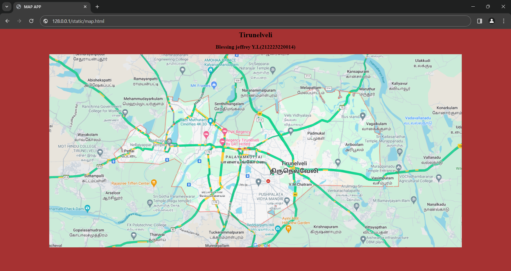
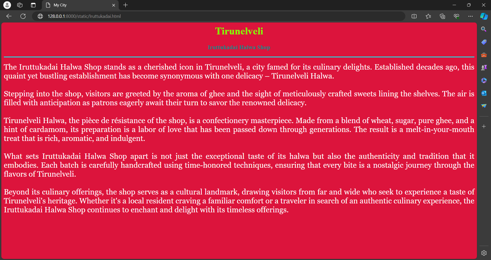
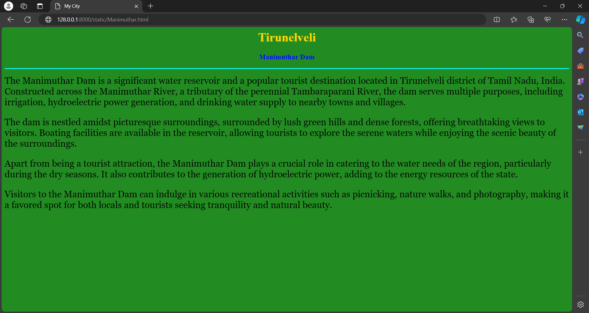
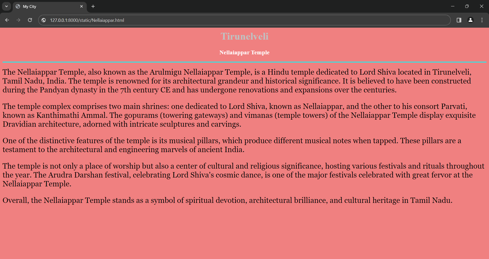
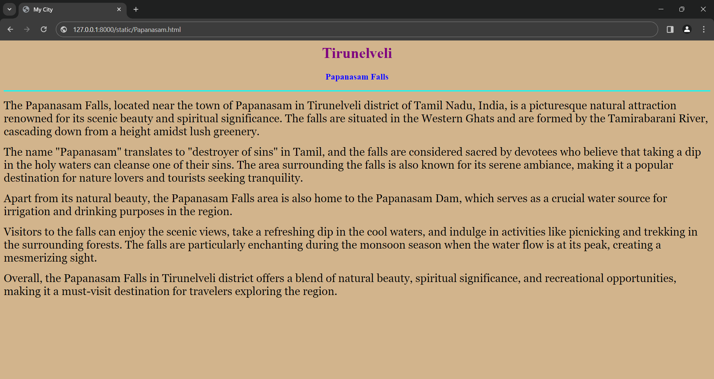

# Ex04 Places Around Me
## Date: 16-04-2024
## Name: Blessing jeffrey Y.L
## Roll.No: 212223220014
## Dept: IT

## AIM
To develop a website to display details about the places around my house.

## DESIGN STEPS

### STEP 1
Create a Django admin interface.

### STEP 2
Download your city map from Google.

### STEP 3
Using ```<map>``` tag name the map.

### STEP 4
Create clickable regions in the image using ```<area>``` tag.

### STEP 5
Write HTML programs for all the regions identified.

### STEP 6
Execute the programs and publish them.

## CODE
```
map.html

<html>
    <head>
        <title>MAP APP</title>
    </head>
    <body style="background-color: rgb(166, 50, 50);">
        <h1 align="center"><b>Tirunelveli</b></h1>
        <h2 align="center"><b> Blessing jeffrey Y.L(212223220014)</b></h2>
        <center>
            

            <map name="image-map">
                <area target="Nellaiappar Temple" alt="Nellaiappar Temple" title="" href="Nellaiappar.html" coords="662,557,295,643" shape="rect">
                <area target="Papanasam Falls" alt="Papanasam Falls" title="" href="Papanasam.html" coords="761,224,82" shape="circle">
                <area target="Manimuthar Dam" alt="Manimuthar Dam" title="" href="Manimuthar.html" coords="869,726,1010,704,1069,729,1001,757,937,757" shape="poly">
                <area target="Manonmaniam Sundaranar University" alt="Manonmaniam Sundaranar University" title="" href="Manonmaniam.html" coords="600,362,97" shape="circle">
                <area target="Iruttukadai Halwa Shop" alt="Iruttukadai Halwa Shop" title="" href="Iruttukadai.html" coords="865,394,1042,468" shape="rect">
</center>
</map>
    </body>
</html>
```
```
Iruttukadai.html

<html>
    <head>
        <title>My City</title>
    </head>
    <body bgcolor="crimson">
        <h1 align="center">
        <font color="chartreuse"><b>Tirunelveli</b></font>
        </h1>
        <h3 align="center">
        <font color="darkcyan"><b>Iruttukadai Halwa Shop</b></font>
        </h3>
        <hr size="3" color="cyan">
        <p align="justify">
        <font face="Georgia" size="5" color="white">
            The Iruttukadai Halwa Shop stands as a cherished icon in Tirunelveli, a city famed for its culinary delights. Established decades ago, this quaint yet bustling establishment has become synonymous with one delicacy – Tirunelveli Halwa.<br><br>Stepping into the shop, visitors are greeted by the aroma of ghee and the sight of meticulously crafted sweets lining the shelves. The air is filled with anticipation as patrons eagerly await their turn to savor the renowned delicacy.<br><br>Tirunelveli Halwa, the pièce de résistance of the shop, is a confectionery masterpiece. Made from a blend of wheat, sugar, pure ghee, and a hint of cardamom, its preparation is a labor of love that has been passed down through generations. The result is a melt-in-your-mouth treat that is rich, aromatic, and indulgent.<br><br>What sets Iruttukadai Halwa Shop apart is not just the exceptional taste of its halwa but also the authenticity and tradition that it embodies. Each batch is carefully handcrafted using time-honored techniques, ensuring that every bite is a nostalgic journey through the flavors of Tirunelveli.<br><br>Beyond its culinary offerings, the shop serves as a cultural landmark, drawing visitors from far and wide who seek to experience a taste of Tirunelveli's heritage. Whether it's a local resident craving a familiar comfort or a traveler in search of an authentic culinary experience, the Iruttukadai Halwa Shop continues to enchant and delight with its timeless offerings.
        </font>
        </p>
    </body>
</html>
```
```
Manimuthar.html

<html>
    <head>
        <title>My City</title>
    </head>
    <body bgcolor="forestgreen">
        <h1 align="center">
        <font color="gold"><b>Tirunelveli
        </b></font>
        </h1>
        <h3 align="center">
        <font color="blue"><b>Manimuthar Dam</b></font>
        </h3>
        <hr size="3" color="cyan">
        <p align="justify">
        <font face="Georgia" size="5">
        <p>The Manimuthar Dam is a significant water reservoir and a popular tourist destination located in Tirunelveli district of Tamil Nadu, India. Constructed across the Manimuthar River, a tributary of the perennial Tambaraparani River, the dam serves multiple purposes, including irrigation, hydroelectric power generation, and drinking water supply to nearby towns and villages.</p>
        <p>The dam is nestled amidst picturesque surroundings, surrounded by lush green hills and dense forests, offering breathtaking views to visitors. Boating facilities are available in the reservoir, allowing tourists to explore the serene waters while enjoying the scenic beauty of the surroundings.</p>
        <p>Apart from being a tourist attraction, the Manimuthar Dam plays a crucial role in catering to the water needs of the region, particularly during the dry seasons. It also contributes to the generation of hydroelectric power, adding to the energy resources of the state.</p>
        <p>Visitors to the Manimuthar Dam can indulge in various recreational activities such as picnicking, nature walks, and photography, making it a favored spot for both locals and tourists seeking tranquility and natural beauty.</p>

        </font>
        </p>
    </body>
</html>
```
```
Manomaniam.html

<html>
    <head>
        <title>My City</title>
    </head>
    <body bgcolor="lightseagreen">
        <h1 align="center">
        <font color="Black"><b>Tirunelveli</b></font>
        </h1>
        <h3 align="center">
        <font color="Red"><b>Manonmaniam Sundaranar University</b></font>
        </h3>
        <hr size="3" color="cyan">
        <p align="justify">
        <font face="Georgia" size="5">
            <p>Manonmaniam Sundaranar University (MSU) is a prominent university located in Tirunelveli, Tamil Nadu, India. Established in 1990, the university is named after the famous Tamil scholar and social reformer, Professor P. Sundaram Pillai.</p>
        <p>MSU offers a wide range of undergraduate, postgraduate, and research programs across various disciplines, including arts, science, commerce, management, and engineering.</p>
        <p>The university is known for its academic excellence, research initiatives, and commitment to holistic development. It has several affiliated colleges spread across the Tirunelveli and Thoothukudi districts, contributing significantly to the educational landscape of the region.</p>
        <p>With its state-of-the-art facilities, experienced faculty members, and vibrant campus life, Manonmaniam Sundaranar University continues to inspire and empower students to excel in their chosen fields and contribute to society.</p>
        <p>Whether it's fostering innovation through research or nurturing talent through quality education, MSU remains dedicated to its mission of shaping future leaders and fostering a culture of excellence.</p>
        <p>As a hub of knowledge and creativity, Manonmaniam Sundaranar University stands as a beacon of academic excellence, enriching the lives of students and contributing to the advancement of society.</p>
        </font>
        </p>
    </body>
</html>
```
```
Nellaiappar.html

<html>
    <head>
        <title>My City</title>
    </head>
    <body bgcolor="lightcoral">
        <h1 align="center">
        <font color="silver"><b>Tirunelveli</b></font>
        </h1>
        <h3 align="center">
        <font color="white"><b>Nellaiappar Temple</b></font>
        </h3>
        <hr size="3" color="cyan">
        <p align="justify">
        <font face="Georgia" size="5">
            <p>The Nellaiappar Temple, also known as the Arulmigu Nellaiappar Temple, is a Hindu temple dedicated to Lord Shiva located in Tirunelveli, Tamil Nadu, India. The temple is renowned for its architectural grandeur and historical significance. It is believed to have been constructed during the Pandyan dynasty in the 7th century CE and has undergone renovations and expansions over the centuries.</p>

            <p>The temple complex comprises two main shrines: one dedicated to Lord Shiva, known as Nellaiappar, and the other to his consort Parvati, known as Kanthimathi Ammal. The gopurams (towering gateways) and vimanas (temple towers) of the Nellaiappar Temple display exquisite Dravidian architecture, adorned with intricate sculptures and carvings.</p>
            
            <p>One of the distinctive features of the temple is its musical pillars, which produce different musical notes when tapped. These pillars are a testament to the architectural and engineering marvels of ancient India.</p>
            
            <p>The temple is not only a place of worship but also a center of cultural and religious significance, hosting various festivals and rituals throughout the year. The Arudra Darshan festival, celebrating Lord Shiva's cosmic dance, is one of the major festivals celebrated with great fervor at the Nellaiappar Temple.</p>
            
            <p>Overall, the Nellaiappar Temple stands as a symbol of spiritual devotion, architectural brilliance, and cultural heritage in Tamil Nadu.
        </font>
        </p>
    </body>
</html>
```
```
Papanasam.html

<html>
    <head>
        <title>My City</title>
    </head>
    <body bgcolor="Tan">
        <h1 align="center">
        <font color="purple"><b>Tirunelveli</b></font>
        </h1>
        <h3 align="center">
        <font color="blue"><b>Papanasam Falls</b></font>
        </h3>
        <hr size="3" color="cyan">
        <p align="justify">
        <font face="Georgia" size="5">
            <p>The Papanasam Falls, located near the town of Papanasam in Tirunelveli district of Tamil Nadu, India, is a picturesque natural attraction renowned for its scenic beauty and spiritual significance. The falls are situated in the Western Ghats and are formed by the Tamirabarani River, cascading down from a height amidst lush greenery.</p><p>The name "Papanasam" translates to "destroyer of sins" in Tamil, and the falls are considered sacred by devotees who believe that taking a dip in the holy waters can cleanse one of their sins. The area surrounding the falls is also known for its serene ambiance, making it a popular destination for nature lovers and tourists seeking tranquility.</p><p>Apart from its natural beauty, the Papanasam Falls area is also home to the Papanasam Dam, which serves as a crucial water source for irrigation and drinking purposes in the region.</p><p>Visitors to the falls can enjoy the scenic views, take a refreshing dip in the cool waters, and indulge in activities like picnicking and trekking in the surrounding forests. The falls are particularly enchanting during the monsoon season when the water flow is at its peak, creating a mesmerizing sight.</p><p>Overall, the Papanasam Falls in Tirunelveli district offers a blend of natural beauty, spiritual significance, and recreational opportunities, making it a must-visit destination for travelers exploring the region.</p>
        </font>
        </p>
    </body>
</html>
```
## OUTPUT










## RESULT
The program for implementing image maps using HTML is executed successfully.
